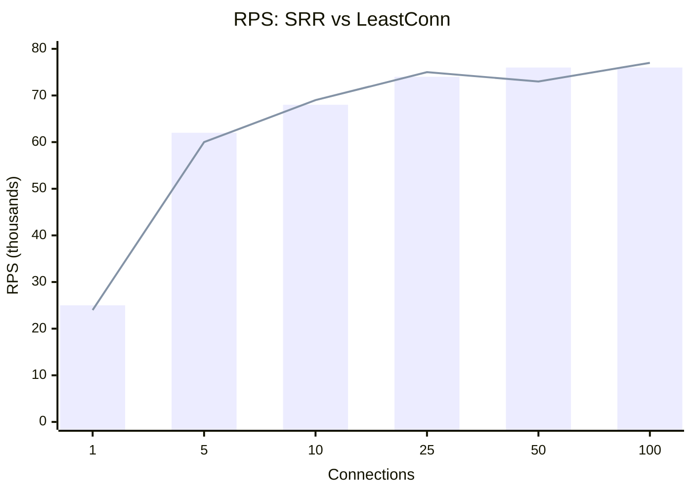
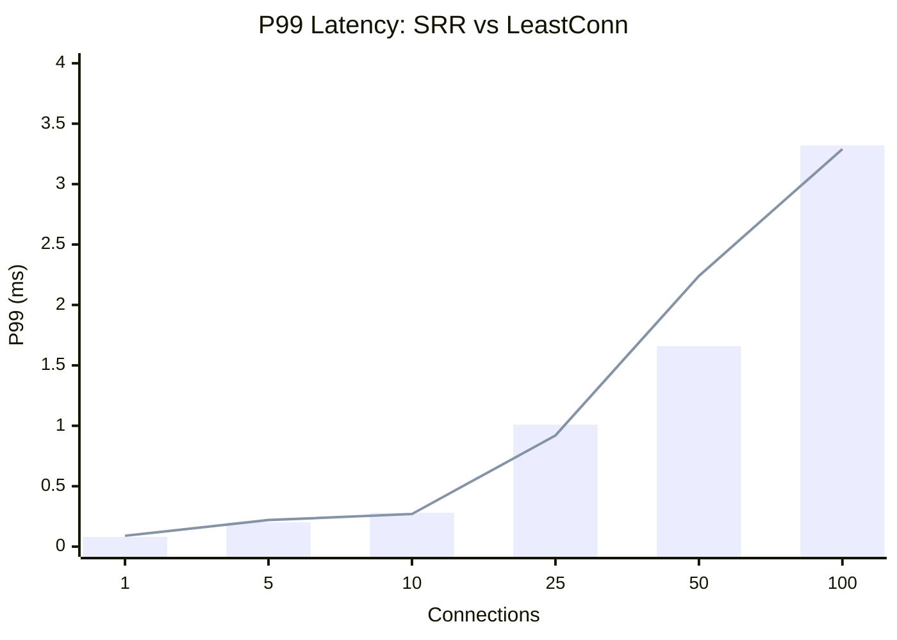
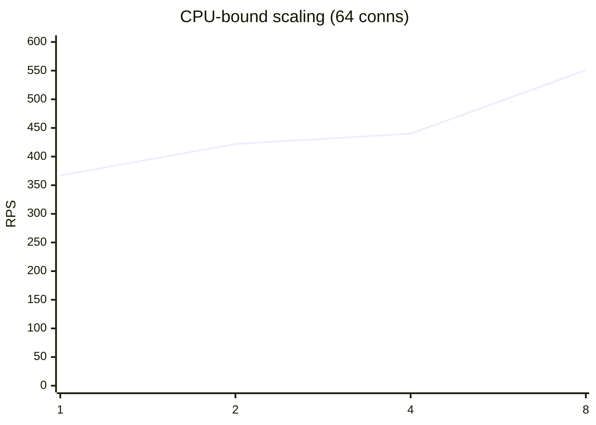
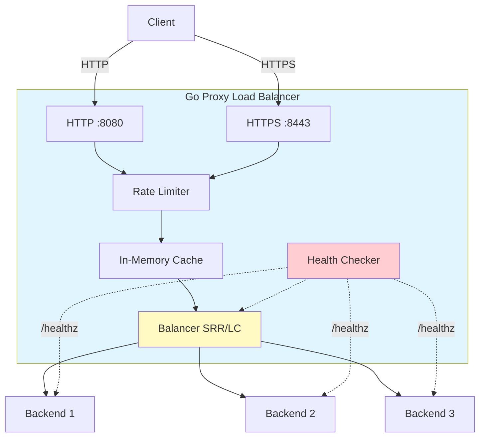

# Go Proxy Load Balancer

High-performance reverse proxy with weighted load balancing.

## Features

- **Smooth Round Robin (SRR)** — weighted distribution, even spreading
- **Weighted Least Connections (LC)** — least-loaded backend selection
- **Health Checks** — automatic backend failure detection & recovery
- **In-Memory Cache** — response caching with TTL
- **Rate Limiting** — per-IP token bucket (golang.org/x/time/rate)
- **Request ID** — UUID per request (tracing)
- **Panic Recovery** — handler panic protection
- **Graceful Shutdown** — clean termination (SIGINT/SIGTERM)
- **SSL Termination** — HTTPS :8443, HTTP :8080
- **Structured Logging** — zap (JSON/console)

## Load Testing

### Algorithm Comparison

**Setup:** 3 backends (weights 10/20/30), wrk, 15s, cache ON, rate limit OFF.

#### RPS



#### P99 Latency



| Conn | Algorithm | RPS | P50 | P75 | P90 | P99 | Max |
|-----:|-----------|----:|----:|----:|----:|----:|----:|
| 1 | **SRR** | **25,497** | 35µs | 42µs | 52µs | 78µs | 3.68ms |
|   | LC | 24,003 | 37µs | 46µs | 57µs | 92µs | 2.62ms |
| 5 | **SRR** | **61,589** | 74µs | 88µs | 107µs | 197µs | 2.81ms |
|   | LC | 59,639 | 76µs | 91µs | 112µs | 215µs | 3.96ms |
| 10 | SRR | 68,340 | 105µs | 126µs | 158µs | 279µs | 2.94ms |
|    | **LC** | **69,149** | 104µs | 125µs | 155µs | 267µs | 1.31ms |
| 25 | SRR | 74,485 | 287µs | 335µs | 447µs | 1.01ms | 25.16ms |
|    | **LC** | **75,185** | 287µs | 333µs | 434µs | **0.92ms** | 5.33ms |
| 50 | **SRR** | **76,374** | 572µs | 659µs | 0.98ms | 1.66ms | 8.59ms |
|    | LC | 72,772 | 584µs | 711µs | 1.13ms | 2.24ms | 22.23ms |
| 100 | SRR | 76,235 | 1.16ms | 1.31ms | 1.95ms | 3.32ms | 29.13ms |
|     | **LC** | **76,554** | 1.14ms | 1.33ms | 1.99ms | 3.29ms | 16.03ms |

### Backend Scenarios

**Setup:** 1 backend `:8004`, wrk 8 conns, 20s, cache TTL 60s.

| Scenario | Cache | RPS | P50 | P75 | P90 | P99 | Max |
|----------|:-----:|----:|----:|----:|----:|----:|----:|
| `GET /api/cached` | ON | **67,376** | 107µs | 129µs | 162µs | 291µs | 7.26ms |
| `GET /api/cached` | OFF | 2,965 | 1.09ms | 34ms | 102ms | 296ms | 477ms |
| `GET /api/fast` | ON | 24,011 | 36µs | 45µs | 54µs | 82µs | 32ms |
| `GET /api/fast` | OFF | 2,831 | 1.06ms | 44ms | 114ms | 264ms | 530ms |
| `POST /api/order` (50-100ms delay) | OFF | 105 | 76ms | 89ms | 97ms | 101ms | 102ms |

> POST tests used a Lua script (`wrk.method = "POST"`). Earlier ~3K RPS results were incorrect — wrk was sending GET requests (405 Method Not Allowed, no delay).

### Contention Scaling

**Setup:** 8 backends, SRR vs LC, 200k iterations.

| Workers | SRR RPS | SRR P50 | SRR P99 | LC RPS | LC P50 | LC P99 |
|--------:|--------:|--------:|--------:|--------:|--------:|--------:|
| 1 | 2.4M/s | 375ns | 458ns | 4.5M/s | 167ns | 291ns |
| 2 | 1.9M/s | 417ns | 15.8µs | 2.8M/s | 250ns | 10.5µs |
| 4 | 1.9M/s | 417ns | 46.3µs | 2.8M/s | 250ns | 30.8µs |
| 8 | 1.9M/s | 417ns | 104.6µs | 2.7M/s | 250ns | 68.3µs |
| 16 | 1.9M/s | 417ns | 228.1µs | 2.7M/s | 250ns | 145.5µs |
| 32 | 1.9M/s | 417ns | 416.4µs | 2.7M/s | 250ns | 293.8µs |

### Backend Scaling

**Setup:** backend4 CPU-bound (~80ms busy-loop), SRR, 64 conns (8 thr × 64), 15s.

| Backends | RPS | P50 | P75 | P90 | P99 | Max |
|---------:|----:|----:|----:|----:|----:|----:|
| 1 | 367 | 163ms | 194ms | 232ms | 531ms | 914ms |
| 2 | 422 | 142ms | 169ms | 205ms | 337ms | 656ms |
| 4 | 440 | 130ms | 164ms | 216ms | 363ms | 706ms |
| 8 | 551 | 103ms | 124ms | 161ms | 334ms | 791ms |



```mermaid
---
config:
  theme: default
---
xychart-beta
    title "P50 latency vs backends"
    x-axis ["1", "2", "4", "8"]
    y-axis "P50 (ms)" 0 --> 200
    line [163, 142, 130, 103]
```

RPS grows with additional backends, but not linearly. The bottleneck is shared between backend CPU (split across N machines) and proxy overhead (body copying, HTTP processing). P50 latency drops from 163ms → 103ms as backends are added, approaching the nominal ~80ms busy-loop duration.

### Unhealthy Backends

**Setup:** 6 backends (4 healthy, 2 unhealthy), 100k iterations.

| Scenario | RPS | P50 | P95 | P99 |
|----------|----:|----:|----:|----:|
| SRR sequential | 3.9M/s | 208ns | 250ns | 250ns |
| LC sequential | 5.3M/s | 166ns | 167ns | 167ns |
| SRR parallel (×8) | 2.9M/s | 250ns | 958ns | 65.2µs |
| LC parallel (×8) | 3.0M/s | 250ns | 1.5µs | 64.1µs |

### Results Summary

- **Ceiling ~76K RPS** — both algorithms hit the HTTP processing bottleneck (serialization, body copy), not the balancer algorithm
- **Cache gives 10-20x** (67K vs 3K RPS) — responses served from memory, no backend roundtrip
- **LC has better tail latency** — P99 more stable at 25+ connections
- **SRR cheaper at low concurrency** — no Acquire/Release overhead
- **LC lower stddev** — more even weight-proportional distribution
- **Scaling — CPU-bound** — 1→8 backends: RPS grows (367→551), P50 drops (163→103ms). Non-linear due to proxy overhead
- **Scaling — I/O-bound (fast)** — 1/3/8 backends yield ~same RPS: bottleneck is the proxy, not backends
- **Scaling — slow (time.Sleep)** — single backend handles 4-8 connections fine (Go goroutines), adding more backends doesn't help
- **Key takeaway:** the load balancer provides benefit only when backends are the bottleneck (CPU-bound, external I/O, connection limits). For fast backends, the proxy itself is the ceiling.

### Scaling Tuning

Initial scaling tests showed no improvement with more backends due to Go HTTP client's default `MaxIdleConnsPerHost = 2`. Under high concurrency, the proxy opened a new TCP connection per request, hitting socket limits instead of backend throughput.

**Fix:** `internal/proxy/handler.go` — `MaxIdleConnsPerHost: 100`. After this fix, the proxy reuses connections and scaling works correctly.

### Tools

- **wrk** — HTTP benchmarking tool (wrk 4.2.0)
- **Go testing** — microbenchmarks for algorithm comparison
- Reproducible via: `test/loadtest/run_wrk.sh`

## Installation

### Build

```bash
git clone <repo-url> proxy-kp
cd proxy-kp
go build -o bin/proxy ./cmd/proxy/
```

### Docker

```bash
docker build -t go-proxy-lb:latest .
```

## Configuration

```yaml
server:
  http_port: 8080
  https_port: 8443
  host: "0.0.0.0"
  read_timeout: 10s
  write_timeout: 10s

tls:
  enabled: false
  cert_file: "/app/certs/server.crt"
  key_file: "/app/certs/server.key"

algorithm: "srr"              # srr | leastconn

backends:
  - url: "http://localhost:8001"
    weight: 10
  - url: "http://localhost:8002"
    weight: 20

health_check:
  interval: 5s
  timeout: 2s
  endpoint: "/healthz"
  failure_threshold: 3
  recovery_interval: 15s

cache:
  enabled: true
  ttl: 60s

rate_limit:
  enabled: true
  requests_per_minute: 600
  burst: 100

logging:
  level: "info"
  format: "json"
```

| Parameter | Description | Default |
|----------|-------------|:-------:|
| `server.http_port` | HTTP port | 8080 |
| `server.https_port` | HTTPS port | 8443 |
| `server.read_timeout` | Read timeout | 10s |
| `server.write_timeout` | Write timeout | 10s |
| `algorithm` | Algorithm: `srr` / `leastconn` | `srr` |
| `backends[].weight` | Backend weight | — |
| `health_check.interval` | Check interval | 5s |
| `health_check.timeout` | Check timeout | 2s |
| `health_check.failure_threshold` | Failures before removal | 3 |
| `health_check.recovery_interval` | Recovery interval | 15s |
| `cache.enabled` | Enable cache | true |
| `cache.ttl` | Cache TTL | 60s |
| `rate_limit.enabled` | Enable rate limit | true |
| `rate_limit.requests_per_minute` | Requests/minute limit | 600 |
| `rate_limit.burst` | Burst | 100 |
| `logging.level` | Level: `debug`/`info`/`warn`/`error` | `info` |
| `logging.format` | Format: `json`/`console` | `json` |

## Project Structure

```
proxy-kp/
├── cmd/proxy/main.go            # Entry point
├── internal/
│   ├── config/config.go         # YAML config
│   └── proxy/                   # HTTP server, handler, middleware
├── pkg/
│   ├── balancer/
│   │   ├── balancer.go          # Balancer interface
│   │   ├── backend.go           # Backend model
│   │   ├── srr/srr.go           # Smooth Round Robin
│   │   └── leastconn/           # Weighted Least Connections
│   ├── cache/                   # In-Memory cache with TTL
│   ├── health/                  # Health check (background worker)
│   ├── ratelimit/               # Per-IP token bucket
│   ├── logger/                  # Structured logger (zap)
│   └── tls/                     # SSL termination
├── test/
│   └── loadtest/                # Load test scripts
├── demo-project/                # Integration demo setup
└── Dockerfile
```

## Architecture



## Docker Compose

```yaml
services:
  proxy:
    image: go-proxy-lb:latest
    container_name: go-proxy-lb
    ports:
      - "8080:8080"
      - "8443:8443"
    volumes:
      - ./config.yaml:/app/config.yaml:ro
      - ./certs:/app/certs:ro
    restart: unless-stopped
    healthcheck:
      test: ["CMD", "wget", "-q", "--no-check-certificate", "--spider", "https://localhost:8443/"]
      interval: 30s
      timeout: 5s
      retries: 3

  backend1:
    build: .
    container_name: backend1

  backend2:
    build: .
    container_name: backend2
```

## SSL Certificate Generation

```bash
mkdir certs
openssl req -x509 -newkey rsa:4096 \
  -keyout certs/server.key -out certs/server.crt \
  -days 365 -nodes
```
