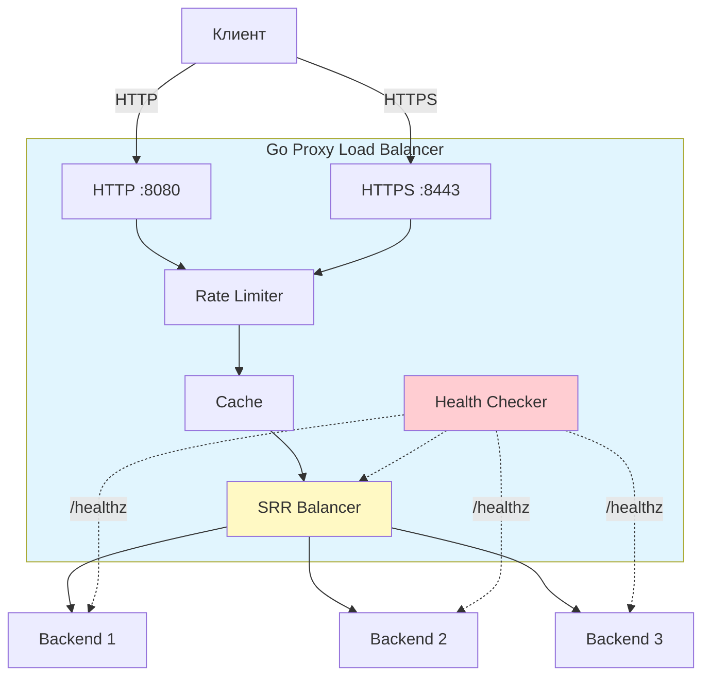

# Go Proxy Load Balancer

Высокопроизводительный обратный прокси-сервер с балансировкой нагрузки.

## Особенности

- **Smooth Round Robin (SRR)** - балансировка с весами backend
- **Health Checks** - автоматическая проверка здоровья
- **In-Memory Cache** - кэширование с TTL
- **Rate Limiting** - защита от DDoS
- **SSL Termination** - HTTPS на порту 8443, HTTP на 8080
- **Graceful Shutdown** - корректное завершение

## Установка в свой проект

### Шаг 1: Сборка Docker образа

```bash
git clone <repo-url> proxy-kp
cd proxy-kp
docker build -t go-proxy-lb:latest .
```

### Шаг 2: Использование в своем проекте

В директории вашего проекта создайте `config.yaml`:

```yaml
server:
  http_port: 8080
  https_port: 8443
  host: "0.0.0.0"

tls:
  enabled: true
  cert_file: "/app/certs/server.crt"
  key_file: "/app/certs/server.key"

backends:
  - url: "http://backend1:8001"
    weight: 10
  - url: "http://backend2:8002"
    weight: 20

health_check:
  interval: 5s
  timeout: 2s
  endpoint: "/healthz"
  failure_threshold: 3
  recovery_interval: 15s

cache:
  enabled: true
  ttl: 60s

rate_limit:
  enabled: true
  requests_per_minute: 600
  burst: 100

logging:
  level: "info"
  format: "json"
```

Добавьте в свой `docker-compose.yml`:

```yaml
services:
  proxy:
    image: go-proxy-lb:latest
    container_name: go-proxy-lb
    ports:
      - "8080:8080"
      - "8443:8443"
    volumes:
      - ./config.yaml:/app/config.yaml:ro
      - ./certs:/app/certs:ro
    restart: unless-stopped
    healthcheck:
      test: ["CMD", "wget", "-q", "--no-check-certificate", "--spider", "https://localhost:8443/"]
      interval: 30s
      timeout: 5s
      retries: 3

  backend1:
    image: your-backend-image
    container_name: backend1

  backend2:
    image: your-backend-image
    container_name: backend2
```

Запустите:

```bash
docker-compose up -d
```

## Генерация SSL сертификатов

Для работы HTTPS нужны сертификаты:

```bash
mkdir certs
openssl req -x509 -newkey rsa:4096 -keyout certs/server.key -out certs/server.crt -days 365 -nodes
```

## Конфигурация

| Параметр | Описание | По умолчанию |
|----------|----------|--------------|
| `server.http_port` | Порт HTTP | 8080 |
| `server.https_port` | Порт HTTPS | 8443 |
| `backends[].weight` | Вес backend | - |
| `health_check.interval` | Интервал проверок | 5s |
| `health_check.failure_threshold` | Неудач для исключения | 3 |
| `cache.ttl` | Время жизни кэша | 60s |
| `rate_limit.requests_per_minute` | Лимит запросов | 600 |

## Структура проекта

```
proxy-kp/
├── cmd/proxy/main.go       # Точка входа
├── internal/
│   ├── config/config.go    # Конфигурация
│   └── proxy/              # HTTP сервер
├── pkg/
│   ├── balancer/           # SRR алгоритм
│   ├── cache/              # In-Memory кэш
│   ├── health/             # Health check
│   ├── ratelimit/          # Rate limiter
│   └── tls/                # SSL termination
└── Dockerfile
```

## Архитектура


