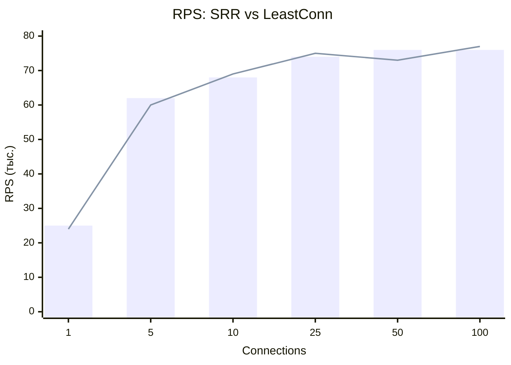
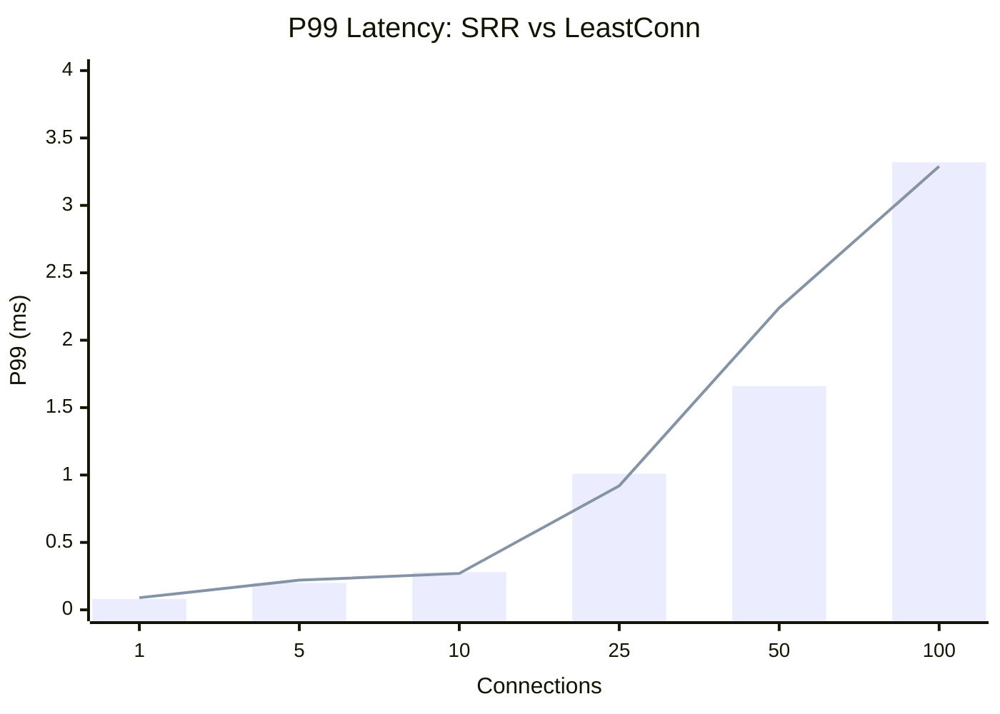
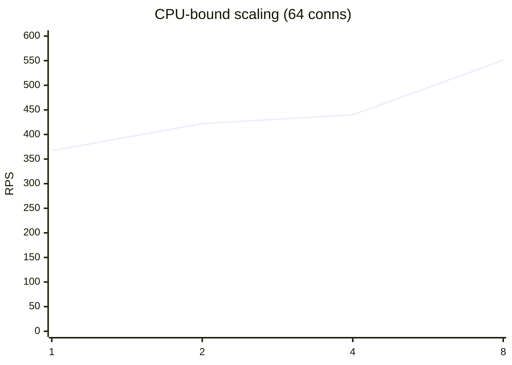
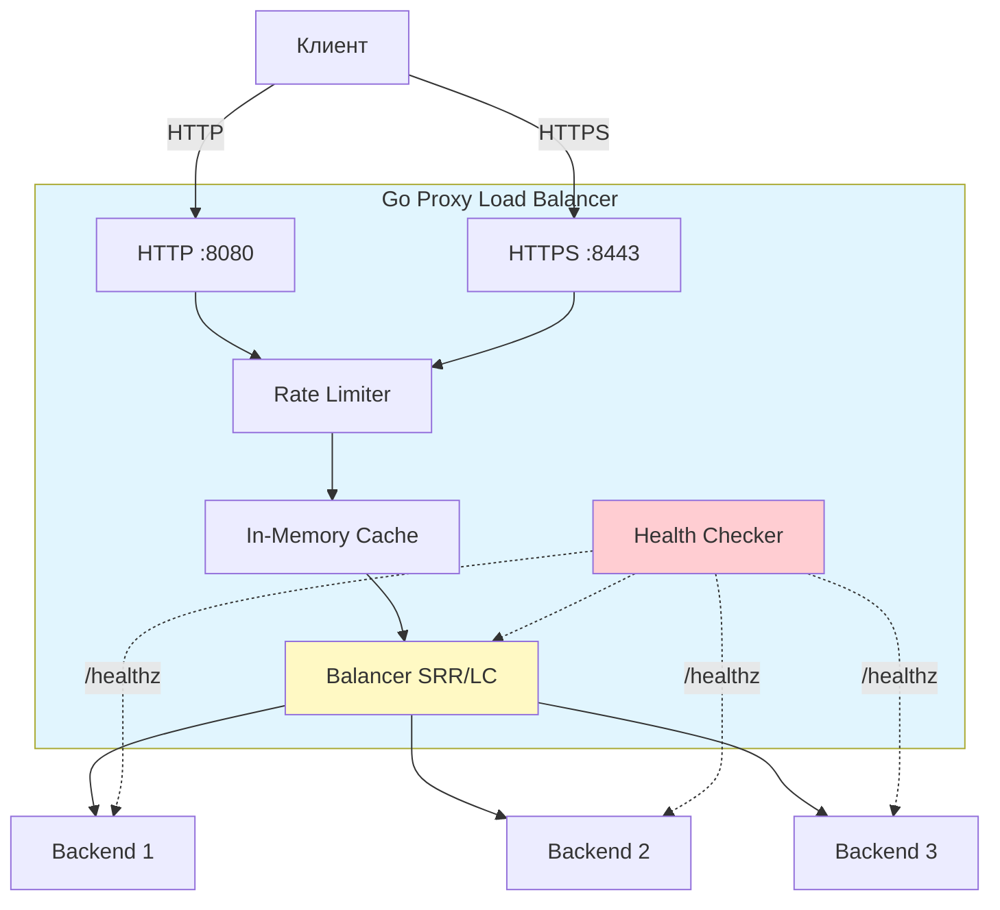

# Go Proxy Load Balancer

Высокопроизводительный обратный прокси-сервер с балансировкой нагрузки.

## Особенности

- **Smooth Round Robin (SRR)** — взвешенная балансировка, равномерное распределение
- **Weighted Least Connections (LC)** — балансировка по наименьшей загрузке
- **Health Checks** — автоматическое обнаружение и восстановление бэкендов
- **In-Memory Cache** — кэширование ответов с TTL
- **Rate Limiting** — per-IP token bucket (golang.org/x/time/rate)
- **Request ID** — UUID на каждый запрос (трейсинг)
- **Panic Recovery** — защита от паник в хендлерах
- **Graceful Shutdown** — корректное завершение (SIGINT/SIGTERM)
- **SSL Termination** — HTTPS на порту 8443, HTTP на 8080
- **Structured Logging** — zap (JSON/console)

## Нагрузочное тестирование

### Сравнение алгоритмов балансировки

**Условия:** 3 бэкенда (веса 10/20/30), wrk, 15s, cache ON, rate limit OFF.

#### RPS


```mermaid
---
config:
  theme: default
---
xychart-beta
    title "RPS: SRR vs LeastConn"
    x-axis "Connections" ["1", "5", "10", "25", "50", "100"]
    y-axis "RPS (тыс.)" 0 --> 80
    bar [25, 62, 68, 74, 76, 76]
    line [24, 60, 69, 75, 73, 77]
```

#### P99 Latency


```mermaid
---
config:
  theme: default
---
xychart-beta
    title "P99 Latency: SRR vs LeastConn"
    x-axis "Connections" ["1", "5", "10", "25", "50", "100"]
    y-axis "P99 (ms)" 0 --> 4
    bar [0.08, 0.20, 0.28, 1.01, 1.66, 3.32]
    line [0.09, 0.22, 0.27, 0.92, 2.24, 3.29]
```

| Conn | Алгоритм | RPS | P50 | P75 | P90 | P99 | Max |
|-----:|----------|----:|----:|----:|----:|----:|----:|
| 1 | **SRR** | **25,497** | 35µs | 42µs | 52µs | 78µs | 3.68ms |
| | LC | 24,003 | 37µs | 46µs | 57µs | 92µs | 2.62ms |
| 5 | **SRR** | **61,589** | 74µs | 88µs | 107µs | 197µs | 2.81ms |
| | LC | 59,639 | 76µs | 91µs | 112µs | 215µs | 3.96ms |
| 10 | SRR | 68,340 | 105µs | 126µs | 158µs | 279µs | 2.94ms |
| | **LC** | **69,149** | 104µs | 125µs | 155µs | 267µs | 1.31ms |
| 25 | SRR | 74,485 | 287µs | 335µs | 447µs | 1.01ms | 25.16ms |
| | **LC** | **75,185** | 287µs | 333µs | 434µs | **0.92ms** | 5.33ms |
| 50 | **SRR** | **76,374** | 572µs | 659µs | 0.98ms | 1.66ms | 8.59ms |
| | LC | 72,772 | 584µs | 711µs | 1.13ms | 2.24ms | 22.23ms |
| 100 | SRR | 76,235 | 1.16ms | 1.31ms | 1.95ms | 3.32ms | 29.13ms |
| | **LC** | **76,554** | 1.14ms | 1.33ms | 1.99ms | 3.29ms | 16.03ms |

### Сценарии бэкенда

**Условия:** 1 бэкенд `:8004`, wrk 8 conns, 20s, cache TTL 60s.

| Сценарий | Cache | RPS | P50 | P75 | P90 | P99 | Max |
|----------|:-----:|----:|----:|----:|----:|----:|----:|
| `GET /api/cached` | ON | **67,376** | 107µs | 129µs | 162µs | 291µs | 7.26ms |
| `GET /api/cached` | OFF | 2,965 | 1.09ms | 34ms | 102ms | 296ms | 477ms |
| `GET /api/fast` | ON | 24,011 | 36µs | 45µs | 54µs | 82µs | 32ms |
| `GET /api/fast` | OFF | 2,831 | 1.06ms | 44ms | 114ms | 264ms | 530ms |
| `POST /api/order` (50-100ms delay) | OFF | 105 | 76ms | 89ms | 97ms | 101ms | 102ms |

> POST тесты выполнялись с Lua-скриптом (`wrk.method = "POST"`). Предыдущие результаты ~3K RPS были некорректны — wrk отправлял GET (405 Method Not Allowed без delay).

### Contention Scaling

**Условия:** 8 бэкендов, SRR vs LC, 200k итераций.

| Workers | SRR RPS | SRR P50 | SRR P99 | LC RPS | LC P50 | LC P99 |
|--------:|--------:|--------:|--------:|--------:|--------:|--------:|
| 1 | 2.4M/s | 375ns | 458ns | 4.5M/s | 167ns | 291ns |
| 2 | 1.9M/s | 417ns | 15.8µs | 2.8M/s | 250ns | 10.5µs |
| 4 | 1.9M/s | 417ns | 46.3µs | 2.8M/s | 250ns | 30.8µs |
| 8 | 1.9M/s | 417ns | 104.6µs | 2.7M/s | 250ns | 68.3µs |
| 16 | 1.9M/s | 417ns | 228.1µs | 2.7M/s | 250ns | 145.5µs |
| 32 | 1.9M/s | 417ns | 416.4µs | 2.7M/s | 250ns | 293.8µs |

### Backend Scaling

**Условия:** backend4 CPU-bound (~80ms busy-loop), SRR, 64 conns (8 thr × 64), 15s.

| Backends | RPS | P50 | P75 | P90 | P99 | Max |
|---------:|----:|----:|----:|----:|----:|----:|
| 1 | 367 | 163ms | 194ms | 232ms | 531ms | 914ms |
| 2 | 422 | 142ms | 169ms | 205ms | 337ms | 656ms |
| 4 | 440 | 130ms | 164ms | 216ms | 363ms | 706ms |
| 8 | 551 | 103ms | 124ms | 161ms | 334ms | 791ms |


```mermaid
---
config:
  theme: default
---
xychart-beta
    title "CPU-bound scaling (64 conns)"
    x-axis ["1", "2", "4", "8"]
    y-axis "RPS" 0 --> 600
    line [367, 422, 440, 551]
```

```mermaid
---
config:
  theme: default
---
xychart-beta
    title "P50 latency vs backends"
    x-axis ["1", "2", "4", "8"]
    y-axis "P50 (ms)" 0 --> 200
    line [163, 142, 130, 103]
```

Рост RPS с добавлением бэкендов заметен, но нелинеен. Причина — узкое место смешанное: и CPU бэкендов (делится на N машин), и оверхед прокси (копирование тела, HTTP processing). P50 latency снижается с 163ms → 103ms по мере добавления бэкендов, приближаясь к номинальным ~80ms busy-loop.

### Unhealthy Backends

**Условия:** 6 бэкендов (4 healthy, 2 unhealthy), 100k итераций.

| Сценарий | RPS | P50 | P95 | P99 |
|----------|----:|----:|----:|----:|
| SRR sequential | 3.9M/s | 208ns | 250ns | 250ns |
| LC sequential | 5.3M/s | 166ns | 167ns | 167ns |
| SRR parallel (×8) | 2.9M/s | 250ns | 958ns | 65.2µs |
| LC parallel (×8) | 3.0M/s | 250ns | 1.5µs | 64.1µs |

### Анализ результатов

- **Потолок ~76K RPS** — оба алгоритма упираются в HTTP processing (сериализация, копирование тела), а не в алгоритм балансировки
- **Кэш даёт x10-20** (67K vs 3K RPS) — ответы из памяти, без похода в бэкенд
- **LC быстрее на хвостах** — P99 у LC стабильнее при 25+ коннектах
- **SRR дешевле на малой конкуренции** — нет оверхеда Acquire/Release
- **Latency stddev у LC ниже** — более равномерное распределение по весам
- **Scaling — бэкенд CPU-bound** — с 1 до 8 бэкендов RPS растёт (367→551), P50 падает (163→103ms). Прирост нелинеен из-за оверхеда прокси
- **Scaling — бэкенд I/O-bound (fast)** — 1/3/8 бэкендов дают ~одинаковый RPS: узкое место в прокси, а не в бэкендах
- **Scaling — бэкенд slow (time.Sleep)** — с 4-8 коннектами один бэкенд не насыщается (Go обрабатывает конкуренцию goroutine-ами), поэтому добавление бэкендов не даёт выигрыша
- **Главный вывод:** балансировщик раскрывает потенциал только когда бэкенды — узкое место (CPU-bound, external I/O, connection limits). Для быстрых бэкендов потолок упирается в сам прокси

### Scaling — тюнинг

Изначально scaling-тесты не показывали роста с добавлением бэкендов из-за дефолтного лимита Go HTTP-клиента `MaxIdleConnsPerHost = 2`. При высокой конкуренции прокси открывал новое TCP-соединение на каждый запрос, упираясь в сокеты, а не в бэкенды.

**Фикс:** `internal/proxy/handler.go` — `MaxIdleConnsPerHost: 100`. После этого прокси переиспользует соединения и scaling заработал.

### Инструменты

- **wrk** — HTTP benchmarking tool (wrk 4.2.0)
- **Go testing** — microbenchmarks для чистого сравнения алгоритмов
- Результаты воспроизводимы: `test/loadtest/run_wrk.sh`

## Установка

### Сборка

```bash
git clone <repo-url> proxy-kp
cd proxy-kp
go build -o bin/proxy ./cmd/proxy/
```

### Docker

```bash
docker build -t go-proxy-lb:latest .
```

## Конфигурация

```yaml
server:
  http_port: 8080
  https_port: 8443
  host: "0.0.0.0"
  read_timeout: 10s
  write_timeout: 10s

tls:
  enabled: false
  cert_file: "/app/certs/server.crt"
  key_file: "/app/certs/server.key"

algorithm: "srr"              # srr | leastconn

backends:
  - url: "http://localhost:8001"
    weight: 10
  - url: "http://localhost:8002"
    weight: 20

health_check:
  interval: 5s
  timeout: 2s
  endpoint: "/healthz"
  failure_threshold: 3
  recovery_interval: 15s

cache:
  enabled: true
  ttl: 60s

rate_limit:
  enabled: true
  requests_per_minute: 600
  burst: 100

logging:
  level: "info"
  format: "json"
```

| Параметр | Описание | По умолчанию |
|----------|----------|:------------:|
| `server.http_port` | Порт HTTP | 8080 |
| `server.https_port` | Порт HTTPS | 8443 |
| `server.read_timeout` | Таймаут чтения | 10s |
| `server.write_timeout` | Таймаут записи | 10s |
| `algorithm` | Алгоритм: `srr` / `leastconn` | `srr` |
| `backends[].weight` | Вес бэкенда | — |
| `health_check.interval` | Интервал проверок | 5s |
| `health_check.timeout` | Таймаут проверки | 2s |
| `health_check.failure_threshold` | Число неудач для исключения | 3 |
| `health_check.recovery_interval` | Интервал восстановления | 15s |
| `cache.enabled` | Включить кэш | true |
| `cache.ttl` | Время жизни кэша | 60s |
| `rate_limit.enabled` | Включить rate limit | true |
| `rate_limit.requests_per_minute` | Лимит запросов/минуту | 600 |
| `rate_limit.burst` | Burst | 100 |
| `logging.level` | Уровень: `debug`/`info`/`warn`/`error` | `info` |
| `logging.format` | Формат: `json`/`console` | `json` |

## Структура проекта

```
proxy-kp/
├── cmd/proxy/main.go            # Точка входа
├── internal/
│   ├── config/config.go         # Конфигурация (YAML)
│   └── proxy/                   # HTTP сервер, handler, middleware
├── pkg/
│   ├── balancer/
│   │   ├── balancer.go          # Интерфейс Balancer
│   │   ├── backend.go           # Модель Backend
│   │   ├── srr/srr.go           # Smooth Round Robin
│   │   └── leastconn/           # Weighted Least Connections
│   ├── cache/                   # In-Memory cache с TTL
│   ├── health/                  # Health check (background worker)
│   ├── ratelimit/               # Per-IP token bucket
│   ├── logger/                  # Structured logger (zap)
│   └── tls/                     # SSL termination
├── test/
│   └── loadtest/                # Нагрузочные тесты
├── demo-project/                # Интеграционный демо-стенд
└── Dockerfile
```

## Архитектура


```mermaid
graph TB
    Client[Клиент]

    subgraph Proxy["Go Proxy Load Balancer"]
        HTTP[HTTP :8080]
        HTTPS[HTTPS :8443]
        RL[Rate Limiter]
        Cache[In-Memory Cache]
        Balancer[Balancer SRR/LC]
        HC[Health Checker]

        HTTP --> RL
        HTTPS --> RL
        RL --> Cache
        Cache --> Balancer
        HC -.-> Balancer
    end

    BE1[Backend 1]
    BE2[Backend 2]
    BE3[Backend 3]

    Client -->|HTTP| HTTP
    Client -->|HTTPS| HTTPS

    Balancer --> BE1
    Balancer --> BE2
    Balancer --> BE3

    HC -.->|/healthz| BE1
    HC -.->|/healthz| BE2
    HC -.->|/healthz| BE3

    style Proxy fill:#e1f5fe
    style Balancer fill:#fff9c4
    style HC fill:#ffcdd2
```

## Запуск Docker Compose

```yaml
services:
  proxy:
    image: go-proxy-lb:latest
    container_name: go-proxy-lb
    ports:
      - "8080:8080"
      - "8443:8443"
    volumes:
      - ./config.yaml:/app/config.yaml:ro
      - ./certs:/app/certs:ro
    restart: unless-stopped
    healthcheck:
      test: ["CMD", "wget", "-q", "--no-check-certificate", "--spider", "https://localhost:8443/"]
      interval: 30s
      timeout: 5s
      retries: 3

  backend1:
    build: .
    container_name: backend1

  backend2:
    build: .
    container_name: backend2
```

## Генерация SSL сертификатов

```bash
mkdir certs
openssl req -x509 -newkey rsa:4096 \
  -keyout certs/server.key -out certs/server.crt \
  -days 365 -nodes
```
